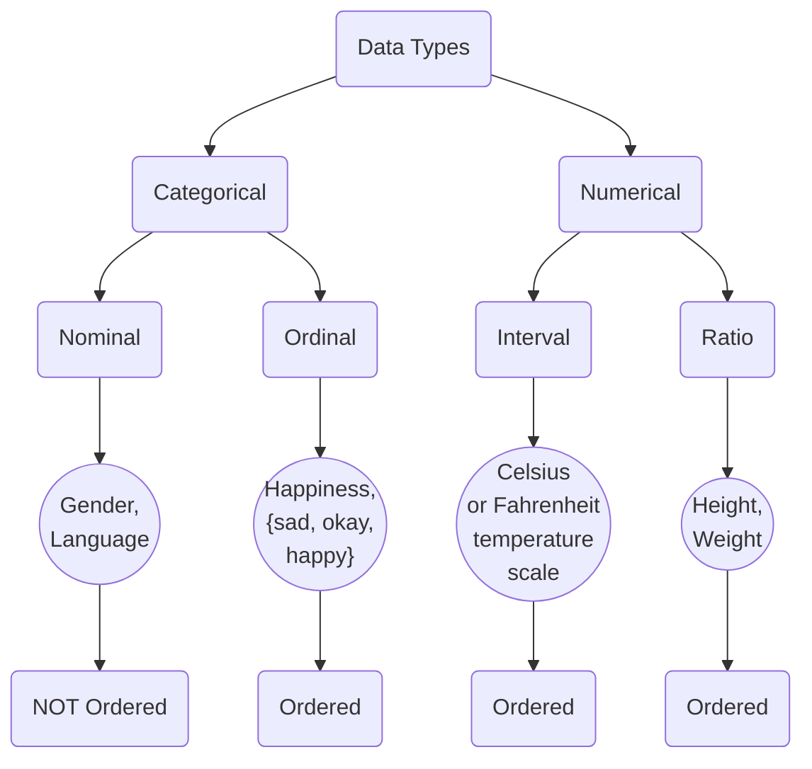

# Data Types

In the context of machine learning, different types of data require different types of processing. The most common data types are:

- Categorical
  - Nominal
  - Ordinal
- Numerical
  - Interval
  - Ratio

Numerical data can be further divided into interval and ratio data. Interval data has no true 
zero i.e temperature, where 0 degrees Celsius is not the absence of temperature, you have a temperature of 0 degrees Celsius. On the other hand, ratio data has a true zero i.e weight, where 0 kg means no weight.

